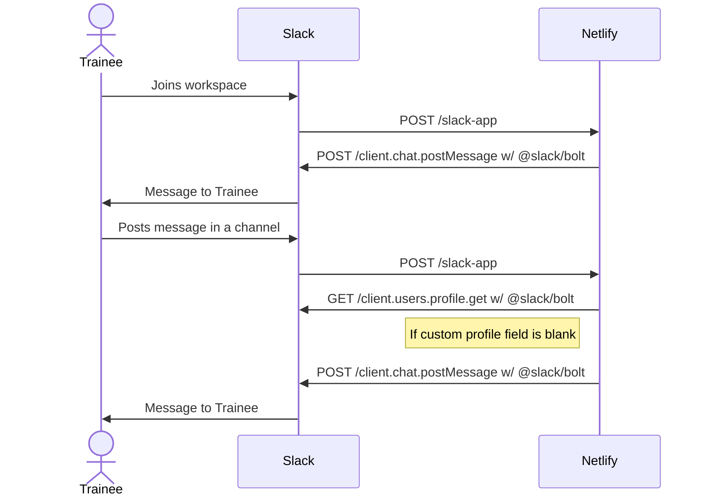

# Custom Slack App for the Identify Trainees tender (Work In Progress)

## What is this?
A lot of Slack users don't set certain custom profile fields which show whether they are a trainee or used to be a trainee.
This Slack sends a message to users asking them to set the field when:
- User joins the workspace.
- Every time a user posts in a channel that the app is installed to and their field is not set.

## Architecture
The sequence diagram below shows the series of events and calls.

## Tech Stack
- Node.js
- Slack JavaScript SDKs
- Jest
- Netlify

## Deployment
- Will be a Netlify serverless function.